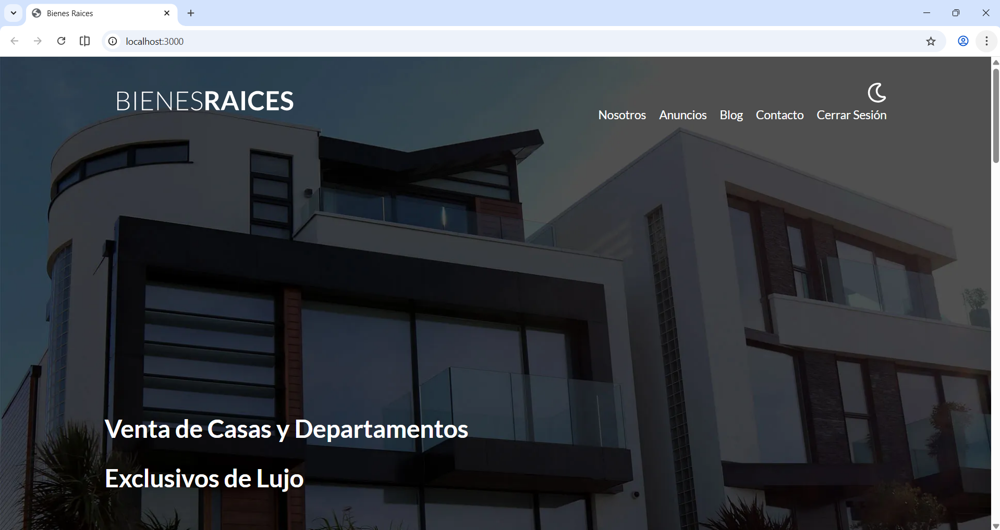
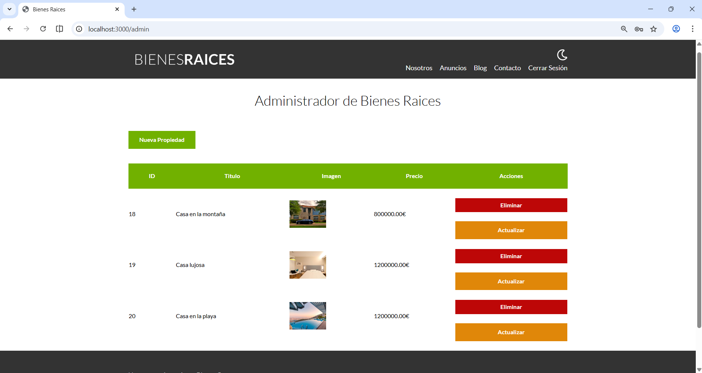

# 🏠 Gestor de Propiedades

Aplicación web desarrollada en **PHP** para la gestión de propiedades inmobiliarias.  
Este proyecto forma parte de mi **portfolio personal** como desarrollador web y simula un sistema real de administración de anuncios con panel de control.

## 🎯 Objetivo del proyecto

El objetivo fue desarrollar una aplicación web completa aplicando:
- Lógica backend con PHP
- Persistencia de datos con MySQL
- Gestión de archivos e imágenes
- Organización de un proyecto realista
- Buenas prácticas de estructura y reutilización de código

---

## 📸 Capturas de pantalla

### Página principal


### Listado de propiedades


### Panel de administración


---

## 🚀 Funcionalidades

- CRUD completo de propiedades
- Panel de administración
- Subida y gestión de imágenes
- Autenticación básica (login / logout)
- Listado y detalle de anuncios
- Código modular y reutilizable

---

## 🛠️ Tecnologías utilizadas

- PHP
- MySQL
- HTML5
- CSS3
- JavaScript
- Apache (XAMPP / Laragon / WAMP)

---

## 📂 Estructura del proyecto

GestorPropiedades/
├── admin/ # Panel de administración
├── build/ # Archivos compilados (CSS, JS)
├── imagenes/ # Imágenes del proyecto
├── includes/ # Funciones y archivos reutilizables
├── src/ # Código fuente principal
├── anuncios.php
├── blog.php
├── cerrar-sesion.php
├── index.php
└── ...


---

## ⚙️ Requisitos

- PHP >= 7.4
- MySQL
- Servidor web local o remoto
- Navegador web moderno

---

## 🔧 Instalación

1. Clonar el repositorio:
   ```bash
   git clone https://github.com/Garocu98/GestorPropiedades.git
Colocar el proyecto en el servidor local:

htdocs/GestorPropiedades
Crear una base de datos en MySQL.

Importar el archivo .sql si existe o crear las tablas manualmente.

Configurar la conexión a la base de datos en includes/.

Acceder desde el navegador:

http://localhost/GestorPropiedades

## 🔐 Acceso al panel de administración

Credenciales de prueba:

Usuario: correo@correo.com
Contraseña: 123456

📌 Mejoras futuras
Refactorización completa a patrón MVC

Sistema de roles

Tests automáticos

Despliegue en producción

✨ Autor
Gabriel Romero Cubas
GitHub: https://github.com/Garocu98
